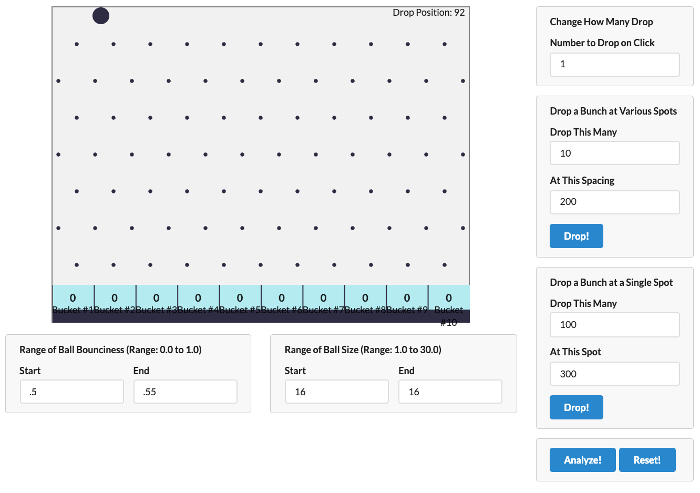

# machine-learning-typescript


**Machine Learning apps using JavaScript/TypeScript with Tensorflow.**

## Key Points

- ### 🎯 Basic Machine Learning Algorithms && Math
- ### 🎯 Theory behind feature selection
- ### 🎯 Testing custom algorithms using test set of data
- ### 🎯 TypeScript & ES2015+
- ### 🎯 Tensorflow usage
- ### 🎯 etc...

## List of apps

### **[Plinko Application](./plinko/README.md)**



- Goal:
  - > Given some data about where a ball is dropped from, can we predict what bucket it will end up in?

### **[House Price](./house-price/README.md)**

```bash
$ npm run start
...
Prediction: 1251260 Real: 1085000 Error: -15.323502304147466%
Prediction: 519756.5 Real: 466800 Error: -11.344580119965723%
Prediction: 433700 Real: 425000 Error: -2.047058823529412%
Prediction: 455800 Real: 565000 Error: 19.327433628318584%
Prediction: 699750 Real: 759000 Error: 7.806324110671936%
Prediction: 584260 Real: 512031 Error: -14.106372465729613%
Prediction: 835450 Real: 768000 Error: -8.782552083333334%
Prediction: 1329790 Real: 1532500 Error: 13.227406199021207%
Prediction: 279422.5 Real: 204950 Error: -36.336911441815076%
Prediction: 228767.5 Real: 247000 Error: 7.381578947368421%
```

- Goal:
  - > Given a House with locations, can we figure out an estimated value of the house based on houses near that point?

### **[Cars](./cars/README.md)**

```bash

$ npm run start

...
Executing Linear regression analysis 📈

> Tensor // predict
    [[...]]
> r2 is ... // Coefficient of Determination value indicating accuracy of current linear regression function.

Finished Linear regression analysis 📉

Executing Logistic regression analysis 📈

Accuracy : x %

Finished Logistic regression analysis 📉
...
```

- Goal:
  - > Linear Regression : Given some data about cars, can we predict relationship between Miles Per Gallon (MPG) and car's Horsepower?
  - > Logistic Regression : Given some data about cars, can we predict relationship with Emission pass or fail?
